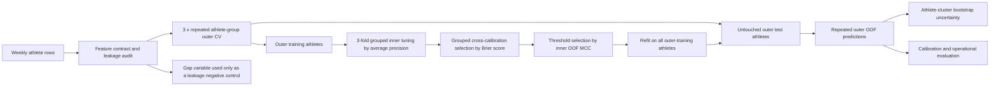

# Leakage-safe injury-model validation

This directory contains the confirmatory rerun of the weekly athlete dataset.
It evaluates generalization of the supplied row-level injury label to athletes
not used for model development. The endpoint is retrospective injury-labelled
event-day classification.

## Analysis command

From the project root:

```bash
python experiments/leakage_safe_validation/run_leakage_safe_validation.py \
  --outer-repeats 3 \
  --outer-folds 5 \
  --inner-folds 3 \
  --bootstrap 2000 \
  --models logistic random_forest xgboost \
  --output experiments/leakage_safe_validation/results
```

The run uses a fixed seed and records the source-data SHA-256 checksum, package versions, feature manifest, every train/test split, every out-of-fold prediction, tuning results, calibration choices, and bootstrap samples.

## Validation design



Outer-test labels are excluded from preprocessing, hyperparameter selection,
probability calibration, and threshold selection. Athlete identity remains
intact across folds, so the outer evaluation represents transfer to unseen
athletes.

## Main finding

The dataset contains 42,798 rows from 74 athletes, including 575 injury-positive rows (1.3435%). After leakage control, all models have modest discrimination and very low precision:

| Model | ROC-AUC (95% CI) | Average precision (95% CI) | MCC (95% CI) | Brier (95% CI) |
|---|---:|---:|---:|---:|
| Logistic regression | 0.608 (0.580–0.639) | 0.0177 (0.0148–0.0220) | 0.0418 (0.0270–0.0582) | 0.01327 (0.01103–0.01597) |
| Random forest | 0.615 (0.581–0.654) | 0.0182 (0.0147–0.0235) | 0.0455 (0.0294–0.0620) | 0.01323 (0.01083–0.01589) |
| XGBoost | 0.592 (0.558–0.625) | 0.0172 (0.0138–0.0234) | 0.0354 (0.0195–0.0524) | 0.01324 (0.01083–0.01593) |

At thresholds selected within training data, the models flag approximately
41–49 of every 100 rows, and about 1.8–1.9% of alerts correspond to positive
injury rows.

The deliberate recording-gap negative control produces ROC-AUC 0.983 and average precision 0.519 by itself, compared with ROC-AUC 0.614 and average precision 0.018 for safe primary features in the same ablation framework. This demonstrates how a deployment-unavailable data artifact can create apparently excellent performance.

## Results map

- `results/METHODS_AND_RESULTS.md`: concise automated analysis report.
- `results/run_metadata.json`: configuration, checksum, dimensions, features, and package versions.
- `results/split_manifest.csv.gz`: complete athlete-group split audit trail.
- `results/outer_oof_predictions.csv.gz`: untouched outer-fold predictions.
- `results/outer_fold_metrics.csv`: variation across all 45 model/fold evaluations.
- `results/model_metrics_with_95ci.csv`: athlete-bootstrap confidence intervals.
- `results/paired_model_differences_95ci.csv`: paired model comparisons.
- `results/inner_tuning_results.csv`: candidate selection in each outer fold.
- `results/inner_calibration_selection.csv`: none/Platt/isotonic selection results.
- `results/leakage_ablation_by_repeat.csv`: deliberate gap-leakage negative control.
- `results/ratio_feature_sensitivity.csv`: sensitivity to unstable supplied load ratios.
- `results/figures/`: discrimination, calibration, uncertainty, and leakage figures.
